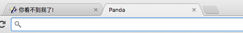
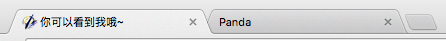

Page Visibility API是HTML5中简单又实用的API之一。

不知道用户是不是在与页面交互，这是困扰广大Web开发人员的一个主要问题。如果页面最小化了或者隐藏在了其他标签页后面，那么有些功能是可以停下来的，比如轮询服务器或者某些动画效果。那么如何判断呢？

H5之前，我们可以监听onfocus()事件。如果当前窗口得到焦点，那么我们可以简单认为用户在与该页面交互，如果失去焦点（onblur()），那么可以认为用户停止与该页面交互。
```
// 当前窗口得到焦点
window.onfocus = function() {
  // 动画开始
};

// 当前窗口失去焦点
window.onblur = function() {
  // 停止动画
};
```
但是这样的方法显然是很 "粗糙" 的。浏览器失去焦点，不意味着用户没在与页面交互，H5引入的Page Visibility API，能很有效地帮助我们完成这样的判断。

这个API本身非常简单，由以下三部分组成。

document.hidden：表示页面是否隐藏的布尔值。页面隐藏包括 页面在后台标签页中 或者 浏览器最小化（注意，页面被其他软件遮盖并不算隐藏，比如打开的 sublime 遮住了浏览器）

document.visibilityState：表示下面 4 个可能状态的值
* hidden：页面在后台标签页中或者浏览器最小化
* visible：页面在前台标签页中
* prerender：页面在屏幕外执行预渲染处理 document.hidden 的值为 true
* unloaded：页面正在从内存中卸载

Visibilitychange事件：当文档从可见变为不可见或者从不可见变为可见时，会触发该事件。

这样，我们可以监听Visibilitychange事件，当该事件触发时，获取document.hidden的值，根据该值进行页面一些事件的处理。
```
document.addEventListener('visibilitychange', function() {
  var isHidden = document.hidden;
  if (isHidden) {
    // 动画停止
  } else {
    // 动画开始
  }
});
```

### 实际运用：

下面是一个根据页面可见性更改title的例子，特别有趣，实现效果如下：
当我选择其他tag时，它的title显示为如下：


当我选择当前页面，它的title显示如下：


废话不说，直接上代码：
```
//考虑了兼容性
var glb = {
  d: document,
  addEvent: function(a, b, c, d) {
    if (a.addEventListener) {
      a.addEventListener(b, c, d)
    } else if (a.attachEvent) {
      a.attachEvent('on' + b, c)
    }
  },
  delEvent: function(a, b, c, d) {
    if (a.removeEventListener) {
      a.removeEventListener(b, c, d)
    } else if (a.detachEvent) {
      a.detachEvent('on' + b, c)
    }
  }
};
glb.stateEvent = function() {
  if (glb.d.visibilityState == 'prerender') {
    glb.d.title = '预渲染中....';
  }
  if (glb.d.visibilityState == 'visible') {
    glb.d.title = '你可以看到我哦~';
  }
  if (glb.d.visibilityState == 'hidden') {
    glb.d.title = '你看不到我了!';
  };
}
glb.stateEvent();
glb.addEvent(glb.d, 'visibilitychange', glb.stateEvent, false);
```
